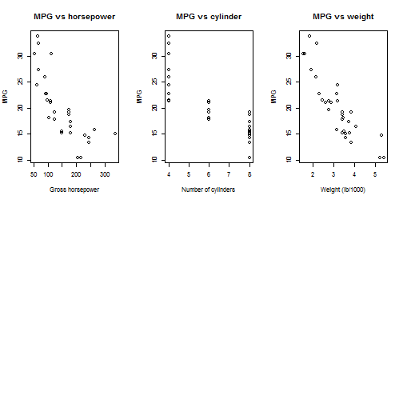

## Summary

Application of linear model to the mtcars dataset, modeling the effect of horsepower, number of cylinders, and weight on the mpg.  Since the only valid possibilities for number of cylinders in the dataset were 4, 6, and 8, the choice have been limited using radio buttons.  For the weight, reactive() is used to convert the user input weight into the units used by the model, lb/1000.  Finally, a pre-set function using the linear model is used to predict the mpg based on the three variables input by the user.

Part1: Shiny Application

* URL: https://swhgoon.shinyapps.io/part1_devdataprod-shiny/ 
* A shiny-App shows the relationship between effect of horsepower, number of cylinders, and weight on the miles per gallon (MPG). 

Part2: Slidify Application

* URL: 

--- .class #id 

## mtcars dataset - Description

### Motor Trend Car Road Tests

The data was extracted from the 1974 Motor Trend US magazine, and comprises fuel consumption and 10 aspects of automobile design and performance for 32 automobiles (1973-74 models).

### Source

Henderson and Velleman (1981), Building multiple regression models interactively. Biometrics, 37, 391-411.


```r
library(datasets)
head(mtcars, 3)
```

```
##                mpg cyl disp  hp drat    wt  qsec vs am gear carb
## Mazda RX4     21.0   6  160 110 3.90 2.620 16.46  0  1    4    4
## Mazda RX4 Wag 21.0   6  160 110 3.90 2.875 17.02  0  1    4    4
## Datsun 710    22.8   4  108  93 3.85 2.320 18.61  1  1    4    1
```

--- .class #id

## Features of the Application

* The application is used for understanding the relationship between effect of horsepower, number of cylinders, and weight on the miles per gallon (MPG).
* The relationship can be visualised using a Scatter plot as well as a regression model
* There is a selector using which the user can select the variable that needs to be used for the comparison
* Also the user has the flexibility to change the Horsepower, number of cylinder and weight on real time basis in the analysis

--- .class #id

## Sample Plots


```r
library(datasets); data(mtcars); par(mfrow = c(2, 3))
with(mtcars, plot(hp, mpg, xlab='Gross horsepower', ylab='MPG', main='MPG vs horsepower'))
with(mtcars, plot(cyl, mpg, xlab='Number of cylinders', ylab='MPG', main='MPG vs cylinder'))
with(mtcars, plot(wt, mpg, xlab='Weight (lb/1000)', ylab='MPG', main='MPG vs weight'))
```

 


